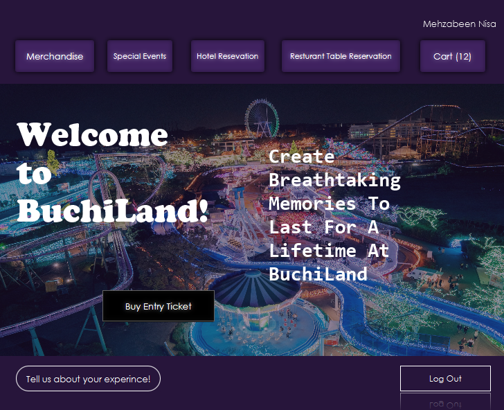

# Amusement Park Management System 🎢

A simulation-based Java project for managing operations in an amusement park, developed as part of my university's Autumn'22 semester course, Object-Oriented Programming (OOP) to demonstrate OOP principles and user interface design. The system includes functionalities for both visitors and park operation managers, with features like login, ticketing, a auto-updating merchandise cart system, and an admin interface.


*Main Home Screen*

## 📌 Features

### 👥 Visitor Side
- Login system
- Ticket purchasing
- Booking ride options
- Table booking & Hotel reservations
- Real-time merchandise cart with inventory updates
### 🎥 Visitor Demo (Click thumbnail)
[](https://youtu.be/0u1YDlMf9E8)

### 🧑‍💼 Operations Manager (Admin) Side
- Add/removechange merchandise or change existing ones
- Inventory management
- Basic operation dashboard
### 🎥 Operations Manager  Demo (Click thumbnail)
[](https://youtu.be/7ax3i-tyYjQ)

## 🛠️ Tools Used

- **Language:** Java
- **Framework:** JavaFX
- **IDE:** IntelliJ IDEA
- **UI Design Tool:** Scene Builder (for FXML layouts)
- **Version Control:** Git & GitHub

## 🚀 Getting Started

### Prerequisites

- Java JDK 11 or higher
- Git

### Installation

```bash
git clone https://github.com/eter-null/amusement-park-management.git
cd amusement-park-management
# Open the project in your preferred IDE and run the main class
